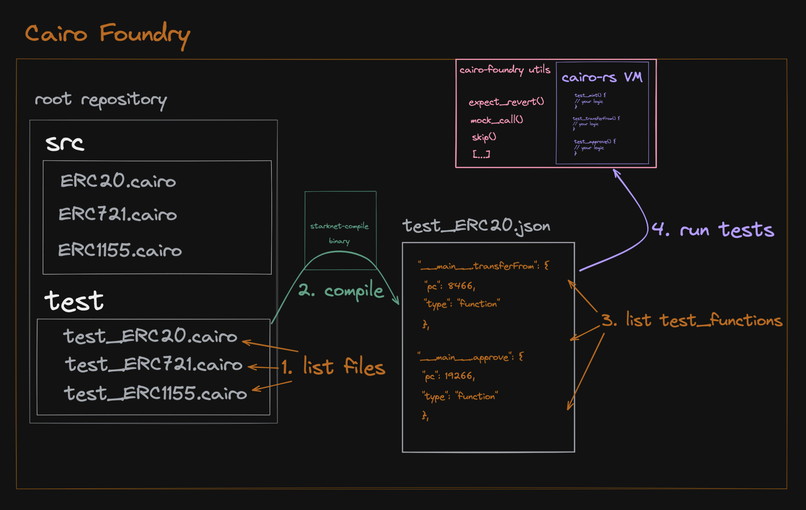
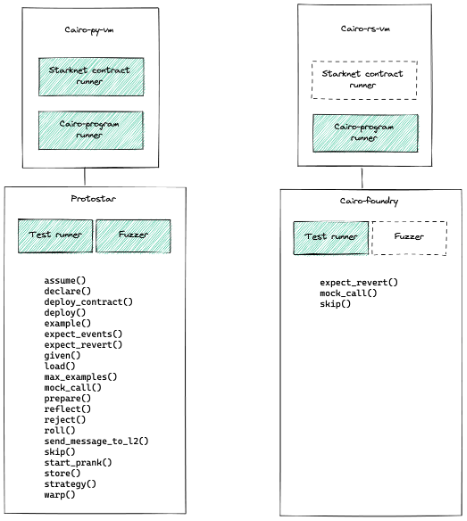

    

  <h1 align="center">cairo-foundry</h1>
  

    
  

  
  <h3 align="center">Blazingly fast testing framework for Starknet contracts development inspired by <a href="https://github.com/foundry-rs/foundry"> Foundry 🦀 🔥 </a></h3>

 

> ## ⚠️ WARNING! ⚠️
>
> This repo contains highly experimental code.
> Expect rapid iteration & frequent breaking changes.

 

## 🏗️ Architecture

Flow Diagram:

 

Objective: match Foundry and/or Protostar utils functions

## 🎟️ Description

Cairo-Foundry is a blazingly fast toolkit for [Starknet](https://starknet.io/) application development. It is comprised of:

-   ✅ A testing framework 🦀
-   🗓️ (long-term plan) A modular CLI/SDK to interact with Starknet smart contracts, sending transactions and getting chain data.
-   🗓️ (long-term plan) A local Starknet node wrapper

The short-term goal is to build an efficient test runner for Cairo smart contract development in Rust. Good comparisons are Protostar test suite (written in Python, for Cairo) or - though less comparable - Jest (written in Javascript, for Javascript) and Pytest (written in Python, for Python).

## 🎗️ Prerequisites

1. Cairo-Foundry uses Rust as its main programming language. To install it 🦀, follow the install steps for the [Rust programming language](https://www.rust-lang.org/tools/install).
2. For now, Cairo-Foundry relies on `cairo-compile`, a Starkware program used to compile Cairo. To install `cairo-compile`, you'll need to install `cairo-lang` as a python package on your local machine. Follow the install steps for the [Cairo programming language](https://www.cairo-lang.org/docs/quickstart.html).

    a. For Mac M1 users, if the install does not work, you may need to refer [to this issue](https://github.com/OpenZeppelin/nile/issues/22) linked to the M1 chip and `fast-ecdsa`, a `cairo-lang` dependency package.
    TL;DR:

    - `brew install gmp` to install the latest version of the _GNU Multiple Precision Arithmetic Library_.
    - Anytime you interact with pip3, or some python package manager that interacts with `cairo-lang`, you'll need specific flags active. Example for installing dependecy package for `cairo-lang`:

        `` CFLAGS=-I`brew --prefix gmp`/include LDFLAGS=-L`brew --prefix gmp`/lib pip3 install ecdsa fastecdsa sympy ``

## 📦 Installation

-   fork the repository
-   create a clone of your fork locally: `git clone https://github.com/<YOUR_HANDLE>/cairo-foundry`
-   if need be, run `poetry install`[^1] to synchronise the python packages, though you shouldn't have to if you followed to steps from the [Cairo programming language set-up guide](https://www.cairo-lang.org/docs/quickstart.html), i.e:
    -   `python3.9 -m venv ~/cairo_venv`
    -   `source ~/cairo_venv/bin/activate`
    -   `pip3 install cairo-lang`
-   You're all set! Run:
    -   `cargo run` to compile project
    -   `cargo test` to run the repository's tests

[^1]: If you haven't installed [poetry](https://python-poetry.org/docs/) yet, run: `curl -sSL https://install.python-poetry.org | python3 -`

## 🔬 Usage

Coming soon! 👷

## 🌡️ Testing

Coming soon! 👷

## 🫶 Contributing

Pull requests are welcome, please check our [contribution guidelines](./CONTRIBUTING.md) .

## 📄 License

**Cairo-Foundry** is released under the [MIT](LICENSE).
